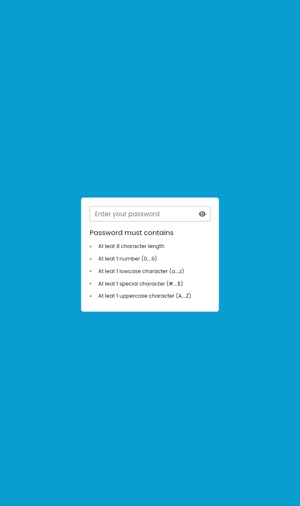

# Password Validation App 

#Design preview

## Welcome! 👋

Thanks for checking out this project.

## The Project

My project is to build out this advice generator app using HTML , CSS and JavaScript 

Users should be able to:

- View the optimal layout for the app depending on their device's screen size
- Check their password validity when they input any password in the input field
- Users can show or hide their password using eye Icon

## Colors
- White : #fff
- Dark blue : #099dd1
- Light gray : #555
- Gray : #999
- Green : #27a30a

- Family: [Poppins](https://fonts.google.com/specimen/Poppins)
- Icon:
[Fontawasome](https://fontawesome.com)
